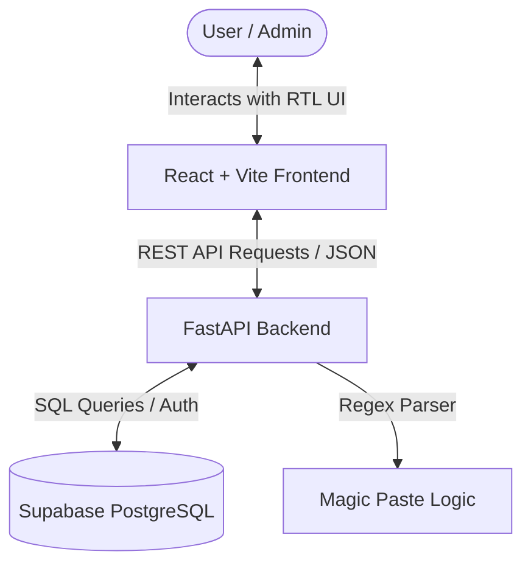

# 🌟 UnformalED — Informal Education Portal

UnformalED is a modern, responsive web application designed for informal education leaders, coordinators, and youth group counselors in Israel. The platform serves as a central hub for managing educational activities, hosting community forum discussions, and using AI/regex-based smart parsers to quickly import activities from social media.

The entire user interface is localized in **Hebrew (RTL)** to cater directly to Israeli educators.

---

## 🏗️ Architecture Overview

The project uses a split client-server architecture:
- **Backend**: [FastAPI](https://fastapi.tiangolo.com/) (Python) serving as a lightweight REST API.
- **Frontend**: [React](https://react.dev/) + [Vite](https://vite.dev/) built with modern CSS and [Lucide React](https://lucide.dev/) icons.
- **Database**: [Supabase](https://supabase.com/) (PostgreSQL) for secure, real-time cloud data storage.



---

## ✨ Key Features

1. **📚 Activity Database (מאגר פעילויות)**
   - Browse and search educational activities by title, keywords, or sub-categories.
   - Filter activities dynamically by core categories (*חגים, פתיחת שנה, קיץ, פעילויות מים, מחוץ למועדון, בתוך המועדון*).
   - View details with exact recommended age ranges (e.g., ages 8-12).
   - Dedicated clean print-friendly layout support (`window.print()`).

2. **⚡ Magic Paste Parser (מנתח פוסטים מהיר)**
   - Allows administrators to paste unstructured Hebrew text blocks (like Facebook group posts).
   - The backend uses regular expressions to parse out the **Title**, **Age Range**, **Equipment / Materials**, and **Content**.
   - Admin can review, modify, assign categories, and save the structured activity directly into the Supabase database.

3. **💬 Community Forum (פורום קהילתי)**
   - Filter discussions by categories: *התייעצות (Consultation), אירוח קבוצות (Group Hosting), דרושים (Jobs/Recruitment), מפעילים חיצוניים (External Operators)*.
   - Distinctive visual styling and contact highlights for external operators.
   - Real-time comment threads for each post.

4. **🔐 Admin Role Access**
   - Access to advanced administrative dashboards (adding activities manually, using the Magic Paste tool) is secured via an admin token.
   - Admins can authenticate by adding `?access=yali123` (configurable) to the URL query string, which persists in browser `localStorage`.

---

## 🛠️ Getting Started

### Prerequisites
- **Python 3.10+**
- **Node.js v18+** & npm
- A **Supabase** account and project database

### 1. Database Setup (Supabase)
Run the following SQL scripts in your Supabase SQL Editor to create the necessary tables:

```sql
-- 1. Activities Table
CREATE TABLE activities (
    id UUID DEFAULT gen_random_uuid() PRIMARY KEY,
    created_at TIMESTAMPTZ DEFAULT now(),
    title TEXT NOT NULL,
    category TEXT NOT NULL,
    sub_category TEXT NOT NULL,
    min_age INT NOT NULL,
    max_age INT NOT NULL,
    content TEXT NOT NULL
);

-- 2. Forum Posts Table
CREATE TABLE forum_posts (
    id UUID DEFAULT gen_random_uuid() PRIMARY KEY,
    created_at TIMESTAMPTZ DEFAULT now(),
    title TEXT NOT NULL,
    category TEXT NOT NULL,
    content TEXT NOT NULL,
    author_name TEXT NOT NULL
);

-- 3. Forum Comments Table
CREATE TABLE forum_comments (
    id UUID DEFAULT gen_random_uuid() PRIMARY KEY,
    created_at TIMESTAMPTZ DEFAULT now(),
    post_id UUID REFERENCES forum_posts(id) ON DELETE CASCADE,
    author_name TEXT NOT NULL,
    content TEXT NOT NULL
);
```

### 2. Backend Installation & Run
1. Navigate to the root directory.
2. Create a `.env` file based on the environment keys:
   ```env
   SUPABASE_URL=your_supabase_project_url
   SUPABASE_KEY=your_supabase_anon_or_service_role_key
   ADMIN_TOKEN=yali123
   ```
3. Create a Python virtual environment and install dependencies:
   ```bash
   python -m venv venv
   # On Windows:
   .\venv\Scripts\activate
   # On macOS/Linux:
   source venv/bin/activate

   pip install -r requirements.txt
   ```
4. Run the FastAPI development server:
   ```bash
   uvicorn main:app --reload
   ```
   The backend will be available at `http://localhost:8000`.

### 3. Frontend Installation & Run
1. Navigate to the `frontend/` directory:
   ```bash
   cd frontend
   ```
2. Install npm dependencies:
   ```bash
   npm install
   ```
3. Start the Vite development server:
   ```bash
   npm run dev
   ```
   Open the browser at the local address printed by Vite (typically `http://localhost:5173`).

---

## 📂 Project Directory Structure

```
unformalED/
│
├── main.py                 # FastAPI backend server & route definitions
├── requirements.txt        # Backend dependencies
├── .env                    # Secret environment credentials (git-ignored)
│
└── frontend/               # React + Vite application
    ├── src/
    │   ├── App.jsx         # Main UI application shell, state & layout
    │   ├── App.css         # Component-specific design & layout rules
    │   ├── index.css       # Core typography & reset styles
    │   └── main.jsx        # App entrypoint
    ├── package.json        # Frontend configuration & dependencies
    └── vite.config.js      # Vite build pipeline setup
```

---

## 🔐 Admin Authentication Detail

To access the administrative dashboard:
1. Open the application: `http://localhost:5173`
2. Add the access token in the query string: `http://localhost:5173/?access=yali123`
3. The dashboard will register you as an administrator, store the credential in your local storage, and unlock the **Admin Dashboard** option on the sidebar as well as the **הוספה מהירה (Quick Add)** options.
